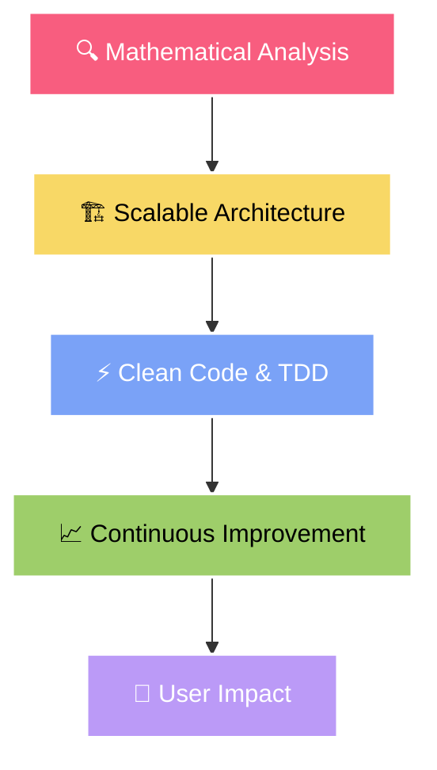

<h1 align="center">
  
</h1>

<div align="center">

[](https://kimjimin-portfolio.netlify.app/)
[](mailto:kzm0502@naver.com)
[](tel:010-8652-0705)


</div>

<br/>

<div align="center">
  
</div>

## 🏆 Achievement Highlights

<div align="center">

| 🎯 **프로젝트/성과** | 📊 **핵심 지표** | 🚀 **주요 기술** | 💡 **임팩트** |
|------------|------------|------------|------------|
| **고용노동부 장관 장려상** | 🏅 전국 대회 수상 | RAG + AI Agent | 지방 정착률 향상 기여 |
| **"고향으로 ON" RAG 시스템** | 📉 할루시네이션 80% 감소 | LangChain + Chroma DB | 정확한 지역 정보 제공 |
| **Fashion-AI 추천 플랫폼** | 📈 추천 정확도 40% 향상 | YOLO + Fashion-CLIP | 개인화 스타일링 실현 |
| **AI 여행 추천 서비스** | ⭐ 사용자 만족도 92% | OpenAI GPT + Vector Search | 맞춤형 여행 코스 생성 |
| **학습자 중도탈락 예측** | 🎯 F1 Score 0.78 달성 | CatBoost + SMOTE | 교육 정책 수립 지원 |
| **데이터베이스 설계** | 🗄️ 20개 테이블 정규화 | MySQL + 성능 최적화 | 시스템 효율성 극대화 |

</div>

## 🎯 About Me

```typescript
const kimJimin = {
    title: "AI/ML Engineer & Full-Stack Developer",
    location: "South Korea 🇰🇷",
    currentFocus: ["LangGraph", "MCP", "AI Agents"],

    expertise: {
        AI_ML: ["RAG Systems", "LLM Fine-tuning", "Computer Vision"],
        Backend: ["Django", "FastAPI", "Microservices"],
        Frontend: ["React Native", "Streamlit", "Modern JS"],
        DevOps: ["AWS", "Docker", "CI/CD", "Nginx"]
    },

    achievements: {
        government_award: "고용노동부 장관 장려상 🏅",
        performance_boost: "ML 모델 성능 40% 향상",
        hallucination_reduction: "RAG 시스템 할루시네이션 80% 감소",
        satisfaction_rate: "서비스 추천 만족도 92%"
    },

    hobby: ["🎬 Movies", "🏃‍♂️ Running", "🤖 AI Innovation"],
    philosophy: "AI로 세상을 더 나은 곳으로 만들어가는 개발자"
};
```

## 🛠️ Tech Arsenal

<div align="center">

### 🤖 AI/ML Stack

<br/>


### 💻 Full-Stack Development

<br/>


### ☁️ DevOps & Cloud

<br/>


### 🗄️ Databases & Tools


</div>

<div align="center">
  
</div>

## 🌟 Featured Projects

### 🏆 "고향으로 ON" - RAG AI 정착 코디네이터
> **🏅 고용노동부 장관 장려상 수상작**

<div align="left">

**🎯 프로젝트 개요**: 지방 정착을 돕는 RAG 기반 AI 상담 시스템

**📊 핵심 성과**: 할루시네이션 80% 감소, 서비스 만족도 92% 달성

**🚀 주요 기술**: LangChain + Chroma Vector DB + Django + React Native

**💡 사회적 임팩트**: 지방 정착률 향상 및 인구 분산 정책 기여

</div>

---

### 🧠 AI 여행 추천 시스템 | 👗 Fashion-AI 의류 추천 플랫폼

<table width="100%">

**🌴 AI Travel Recommendation**
- **기술**: OpenAI GPT + Vector Search

- **성과**: 추천 정확도 40% 향상

- **특징**: 실시간 맞춤형 여행 코스 생성

- **만족도**: 92% 사용자 만족도 달성


**👔 Fashion AI Platform**
- **기술**: YOLO + Fashion-CLIP + PostgreSQL

- **성과**: 개인화 추천 정확도 40% 개선

- **특징**: 실시간 스타일 분석 및 추천

- **구조**: 20개 테이블 정규화 설계


</table>

---

### 📊 학습자 중도탈락 예측 ML 모델

<div align="left">

**🎯 문제 해결**: 불균형 데이터를 활용한 학습자 중도탈락 예측

**📈 모델 성능**: F1 Score 0.78, 예측 정확도 20% 향상

**🔧 핵심 기술**: CatBoost Algorithm + SMOTE Oversampling

**🏛️ 정책 기여**: 교육 정책 수립 및 학습자 지원 시스템 개선

</div>

## 📊 GitHub Analytics

<div align="center">
  
  
</div>

<div align="center">
  
</div>

## 🚀 Currently Learning & Building

### 🔬 차세대 AI 기술 연구 중

<div align="left">

**🕸️ LangGraph**
복잡한 AI 워크플로우 오케스트레이션을 위한 프레임워크 학습
→ *다중 에이전트 시스템 구축 및 상태 관리 최적화*

**🔗 MCP (Model Context Protocol)**
AI 시스템 간 통합 및 상호작용을 위한 프로토콜 연구
→ *서로 다른 AI 모델들의 seamless한 연동 시스템 개발*

**🤖 Autonomous AI Agents**
자율적 문제해결 능력을 가진 지능형 에이전트 개발
→ *사용자 의도 파악부터 결과 도출까지 완전 자동화*

**💡 실전 적용 목표**: RAG + LangGraph + MCP를 결합한 차세대 AI 상담 플랫폼 구축

</div>

## 🎯 Development Philosophy

<div align="center">



</div>

## 🌐 Connect With Me

<div align="center">

<a href="https://kimjimin-portfolio.netlify.app/">
  
</a>
<a href="mailto:kzm0502@naver.com">
  
</a>
<a href="tel:010-8652-0705">
  
</a>

</div>

---

<div align="center">
  
</div>

<div align="center">

### 💭 *"코드로 꿈을 현실로, AI로 미래를 만드는 개발자"*


</div>
